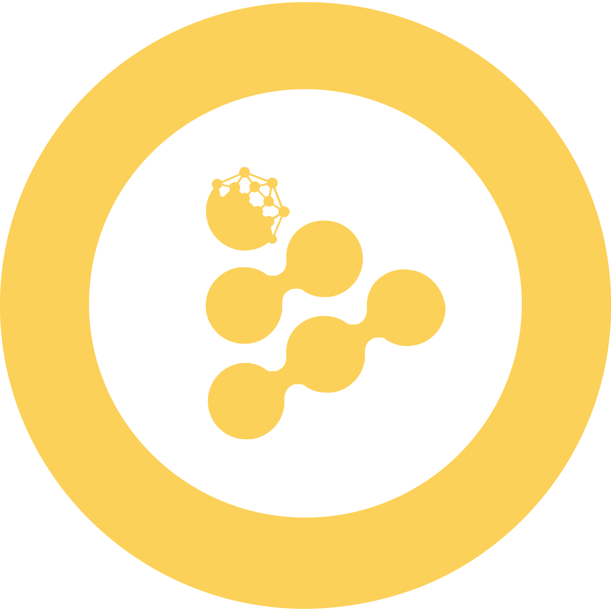

Greetings, my name is Dāvis and this is my corner on the World Wide Web, welcome! 
 
 
Over the past couple of years, my professional journey has been quite a ride. I've shifted from people-oriented roles to tech-focused positions and <i>vice versa</i>. My adventurous spirit has taken me to places most folks would steer clear of, all driven by ideals and a hunger for experience.
 
 
I am passionate about all things information technology, it specially UNIX-like operating systems, information security, and data/information analysis. I am always open to interesting projects and collaborations.
 
 
Holla at me by dropping a message to: <a href=mailto:hello@dvilcans.com>hello@dvilcans.com</a>
 
 

#### Some of my recent projects:

* [ÐiSCO](https://disco.dvilcans.com/en) -- Graphical user interface for launching data processing with [DEPI/IPED](https://dvilcans.com/depi/);
* [txt2img](https://txt2img.dvilcans.com) -- Online AI tool for text to image generation;  
* [Harry the O.G.](https://chat.dvilcans.com) -- A simple online AI chatbot.
* [Bashbot](https://dvilcans.com/ai-chatbot-in-linux-terminal/) -- AI chatbot in a Linux terminal.

 

#### Enjoying my content? Feel free to send a little love with a crypto tip:

    

         
        BTC: 3N1j1JJUHHxUC68UeqBZKCYf3fBMfzyBFJ (Bitcoin network)
    

    

         
        ETH: 0x466d8184ac8108ed03ff5146e8bbeebc1b46e088 (Ethereum network)
    

    

         
        DOT: 14TXHQTk518nPXECWJ4q8VXJK3gzgoqdJbkv1P4ZzyVzKrui
    

    

             
            XMR: 82tm9q1nYEpVhXqYoksQRBWxVqvWoSpwweUyvi85w81EZbsM3kBxY7ND7qWNNYwqUh6Utqrnm7sXYUh753pgpe8DHiNJ5p8
    

    

         
        RLC: 0x466d8184ac8108ed03ff5146e8bbeebc1b46e088 (Ethereum network)
    

    

         
        DOGE: DGc2V84o2mudYSY5NzmfjMgUNEiChRVv9a
    

    

         
        USDC: 0x466d8184ac8108ed03ff5146e8bbeebc1b46e088 (Ethereum network)
    

    

         
        USDT: 0x466d8184ac8108ed03ff5146e8bbeebc1b46e088 (Ethereum network)
    

