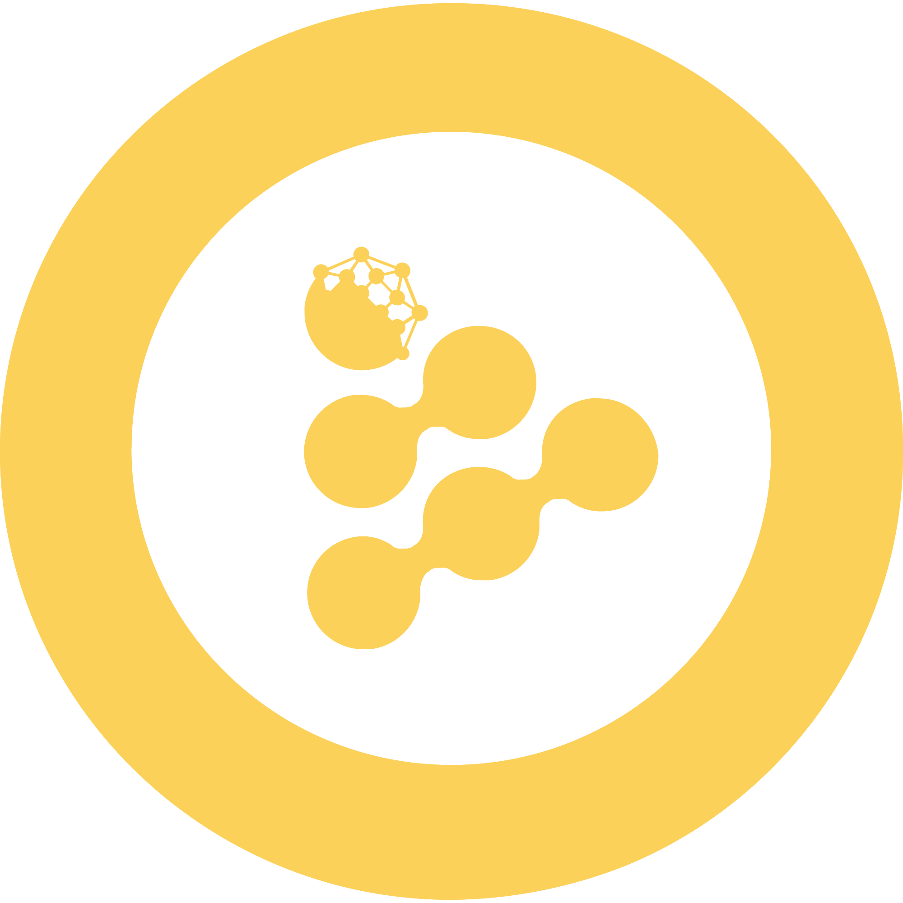

Sveicināti, mans vārds ir Dāvis un šis ir mans stūrītis vispasaules tīmeklī, laipni lūgti!
 
 
Mans pēdējo pāris gadu profesionālais ceļojums ir bijis visnotaļ interesants un daudzpusīgs. Esmu strādājis kā ar cilvēkiem tā ar tehnoloģijām un pateicoties kārei pēc piedzīvojumiem esmu pabijis dažādās <i>eksotiskās</i> vietās, no kurām vairums cilvēku visticamāk labprātāk turētos pa gabalu.
 
 
Mani aizrauj viss, kas saistīts ar informācijas tehnoloģijām, it īpaši <i>UNIX</i>-veidīgām operētājsistēmām, informācijas drošību un datu/informācijas analīzi. Es vienmēr esmu atvērts interesantiem projektiem un sadarbībai.
 
 
Ar mani var sazināties rakstot uz: <a href=mailto:sveiks@dvilcans.com>sveiks@dvilcans.com</a>.
 
 

#### Daži no maniem pēdējā laika eksperimentiem:

* [txt2img](https://txt2img.dvilcans.com) -- Tiešsaistes mākslīgā intelekta rīks, kas no teksta ģenerē attēlus;  
* [Harry the O.G.](https://chat.dvilcans.com) -- Vienkāršs tiešsaistes mākslīgā intelekta čatbots;
* [Bashbot](https://dvilcans.com/lv/ai-chatbot-in-linux-terminal/) -- MI čatbots Linux terminālī.

 

#### Patīk mans saturs? Nopērc man kādu našķi:   

    

         
        BTC: 3N1j1JJUHHxUC68UeqBZKCYf3fBMfzyBFJ (Bitcoin network)
    

    

         
        ETH: 0x466d8184ac8108ed03ff5146e8bbeebc1b46e088 (Ethereum network)
    

    

         
        DOT: 14TXHQTk518nPXECWJ4q8VXJK3gzgoqdJbkv1P4ZzyVzKrui
    

    

             
            XMR: 82tm9q1nYEpVhXqYoksQRBWxVqvWoSpwweUyvi85w81EZbsM3kBxY7ND7qWNNYwqUh6Utqrnm7sXYUh753pgpe8DHiNJ5p8
    

    

         
        RLC: 0x466d8184ac8108ed03ff5146e8bbeebc1b46e088 (Ethereum network)
    

    

         
        DOGE: DGc2V84o2mudYSY5NzmfjMgUNEiChRVv9a
    

    

         
        USDC: 0x466d8184ac8108ed03ff5146e8bbeebc1b46e088 (Ethereum network)
    

    

         
        USDT: 0x466d8184ac8108ed03ff5146e8bbeebc1b46e088 (Ethereum network)
    

