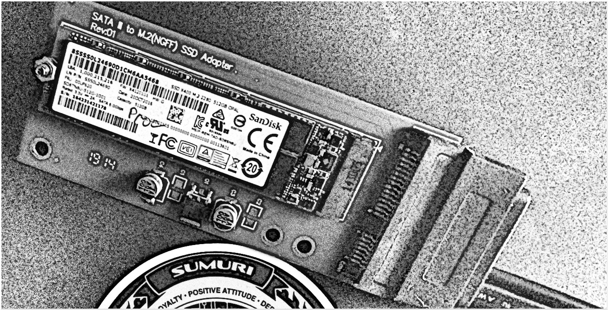
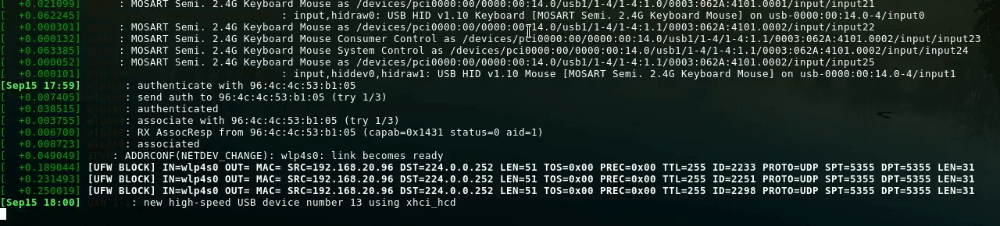
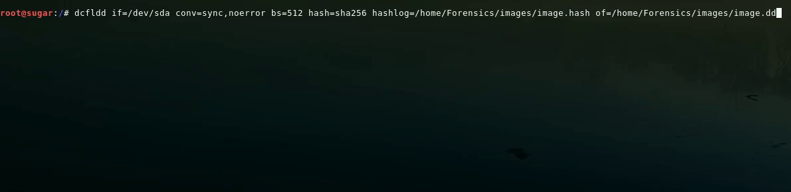
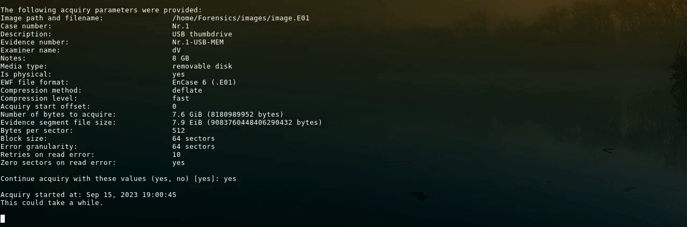

Today I will share my take on performing **forensic disk imaging** using a Linux operating system. 

I use Debian but my approach can be reproduced on any distribution that uses _systemd_ as the init system. 

###### Preparing the operating system

Ideally forensic imaging should be done using hardware write-blockers, but if that is not an option, Linux operating system can be set up in a way to perform imaging in a forensically sound manner. It is achieved by disabling the "automount" functionality of the operating system. 

Whenever we attach a disk device to our computer, all the partitions that contain recognized filesystems are mounted. That is something that we need to avoid to ensure that the data does not get altered. 

To disable automount on distributions that use _systemd_ you can disable and mask the **udisks2.service**.



systemctl stop udisks2.service



systemctl mask udisks2.service


Afterwards when running:


systemctl status udisks2.service


There should be an output like this:
```
● udisks2.service
     Loaded: masked (Reason: Unit udisks2.service is masked.)
     Active: inactive (dead) since Thu 2023-09-14 21:33:57 EEST; 7s ago
   Main PID: 1220 (code=exited, status=0/SUCCESS)
        CPU: 409ms
```
###### Checking kernel messages in real-time and connecting the drive


dmesg -Hw




###### Listing block devices to double check the attached drive


lsblk


```
NAME                   MAJ:MIN RM   SIZE RO TYPE  MOUNTPOINT
sda                      8:0    1   7.6G  0 disk  
└─sda1                   8:1    1   7.6G  0 part  

```

The attached drive has been assigned to a block device identificator **sda**, it contains one partition sda1. The drive can be accessed at **/dev/sda**.

###### Imaging the drive: choosing the tool

The two tools that I use most often are **dcfldd** and **ewfacquire**. 

**dcfldd** is a derrivative of dd, it features hashing on-the-fly and status output by default. Sometimes you have to stick with the default tools, so it should be noted that hashing on-the-fly can be attained by regular dd as well, by using pipes. Also starting from _coreutils v.8.24_, dd features a progress bar which can be called by attaching a simple "status=progress" at the end of the command.

**ewfacquire** is a part of the _ewf-tools_ package. It acquires data in the _Expert Witness Format_ (EWF, extension .E01). This is a widely accepted forensic image format used by programms like _EnCase_ and _FTK imager_. 

When to use which? 

I use **dcfldd** if I know that at some point I am going to virtualize the image, or if I know that at some point I am going to mount the image and the image contains encrypted partitions or relevant volume shadow copies. 

I use **ewfacquire** if I want the image to take up less space and I know that I will not be performing the aforementioned activities.

###### Imaging the drive: dcfldd

dcfldd if=/dev/sda conv=sync,noerror bs=512 hash=sha256 hashlog=/home/Forensics/images/image.hash of=/home/Forensics/images/image.dd




* **if** – input file;
* **conv=sync,noerror** – synchronize and skip any read errors;
* **bs** – blocksize;
* **hash** – hashing algorithm of choice;
* **hashlog** – location and filename for saving the calculated hash;
* **of** – location and filename for the output.

###### Imaging the drive: ewfacquire

ewfacquire features an interactive prompt.  


ewfacquire /dev/sda


```
ewfacquire 20140807

Device information:
Bus type:				USB
Vendor:					SMI
Model:					USB DISK
Serial:					AA00000000000485

Storage media information:
Type:					Device
Media type:				Removable
Media size:				8.1 GB (8180989952 bytes)
Bytes per sector:			512

Acquiry parameters required, please provide the necessary input

Image path and filename without extension: /home/Forensics/images/image
Case number: Nr.1
Description: USB thumbdrive
Evidence number: Nr.1-USB-MEM 
Examiner name: DV
Notes: 8 GB
Media type (fixed, removable, optical, memory) [removable]: removable
Media characteristics (logical, physical) [logical]: physical
Use EWF file format (ewf, smart, ftk, encase1, encase2, encase3, encase4, encase5, encase6, linen5, linen6, ewfx) [encase6]: encase6
Compression method (deflate) [deflate]: deflate
Compression level (none, empty-block, fast, best) [none]: fast
Start to acquire at offset (0 <= value <= 8180989952) [0]: 
The number of bytes to acquire (0 <= value <= 8180989952) [8180989952]: 
Evidence segment file size in bytes (1.0 MiB <= value <= 7.9 EiB) [1.4 GiB]: 7.9 EiB
The number of bytes per sector (1 <= value <= 4294967295) [512]: 
The number of sectors to read at once (16, 32, 64, 128, 256, 512, 1024, 2048, 4096, 8192, 16384, 32768) [64]: 
The number of sectors to be used as error granularity (1 <= value <= 64) [64]: 
The number of retries when a read error occurs (0 <= value <= 255) [2]: 10
Wipe sectors on read error (mimic EnCase like behavior) (yes, no) [no]: yes
```


* **Media characteristics** – physical for devices, logical for files;
* **Use EWF file format** – I always go with EnCase6, to prompt for the default option in the brackets just hit enter;
* **Compression level** – If time is not of the essence I opt for "best"; 
* **Evidence segment file size** – To avoid fragmentation I go with "7.9 EiB";
* **The number of bytes per sector** – device specific, can be 512, 2048, 4096, etc;
* **The number of sectors to read at once** – impacts the imaging speed;
* **Error granularity** – how many sectors will be discarded if a read error occurs;    

The above settings are suitable for error free drives. If you encounter a bad drive you may want to decrease **the number of sectors to be read at once** and **error granularity** as well as increase **retries on read error**. 

Imaging bad drives can take ages, if it is really bad it could be better to opt for a tool like **ddrescue**.


