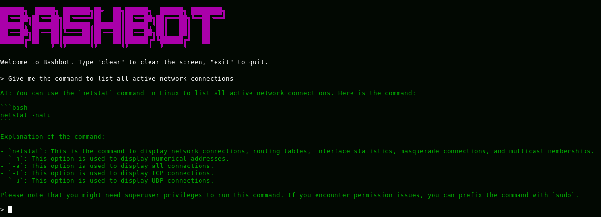

#### What is Bashbot?

Bashbot is a script that allows you to interact with an AI-powered chatbot from the Linux terminal. The chatbot is a Cloudflare Worker that is set up to use the [deepseek-coder-6.7b-instruct-awq](https://developers.cloudflare.com/workers-ai/models/deepseek-coder-6.7b-instruct-awq/) LLM. 

#### Why I created Bashbot?

I spend quite a lot of time in the Linux terminal and it is very handy to be able to pass some quick querries to an AI directly from the terminal.

#### Limitations:

Currently the output of a single querry is limited to around 800 characters. To extend the length of the output I would have to implement [streaming](https://blog.cloudflare.com/workers-ai-streaming), which is something that I'd like to try in the future. Then the script would have to be rewritten using a programming language. Python seems like the obvious choice, but I'd like to give Go a go :) 

#### Want to try out Bashbot?

You can find the script along with an instruction on my [GitHub page](https://github.com/reacan/bashbot).

