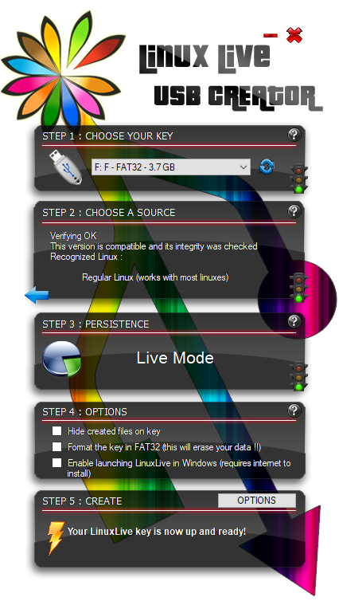

## Sumuri
[Sumuri](https://sumuri.com/) is a US-based company that is providing forensic software and hardware solutions. They are perhaps best known for their "TALINO" series of laptops, computers and servers and their MacOS imaging tool -- "RECON ITR". Sumuri positions itself as a community-conscious company outlining honor, integrity, loyalty, positive attitude, dedication and altruism as their core values.  

What is awesome about Sumuri is that not only they talk the talk, but they also walk the walk. They offer a customized live forensic Linux distribution as a donationware -- it is free for non-commercial use and commercial use requires a minimum of $25.00 donation per user per year.

## PALADIN

PALADIN is a live linux distribution based on Ubuntu that aims to simplify various forensic tasks -- imaging, triaging, processing, analyzing and reporting. 

It comes in two flavours -- **EDGE** (32-bit/64-bit) and **LTS** (64-bit only). Both EDGE and LTS feature the **PALADIN Toolbox** -- a GUI application that features controls for imaging, formatting, mounting, decrypting and triaging. LTS additionally features a collection of more than 100 different forensic tools, including Autopsy 4.

## Point and click

PALADIN is intended to be a "point-and-click" type of a tool, however to use most of the additional forensic tools included in the LTS version some level of command line proficiency is required. In this article I will try to look into PALADIN from the Windows user's "point-and-click" perspective.  

I got myself a PALADIN EDGE weighing in at 1.9 GB's and LTS -- 3.7 GB's. I will go with the LTS to explore the additional tools as well. 

## Creating a bootable USB stick on Windows

On Linux you type in a single tiny line of text in the terminal in order to create a bootable USB stick. Unfortunately that is not the case with Windows. On Windows I am using a tool called **Lili -- Linux Live USB Creator**. It is relatively simple and it has a beautiful interface.

## Booting from a USB stick

Usually tapping the **F12** key during the boot brings up the quick boot menu on PC's and on Macs you just have to hold the **option key (⌥)**. On PC's the quick boot menu may be disabled and you may have to tinker with BIOS/UEFI. If it is a real life case I recommend dettaching the device's disk drive on first boot if possible. 

#### Common issues when booting from a USB stick

Sometimes booting from a USB stick can be quite challenging. Here are some of the issues I've encountered:
* PC boots straight to Windows:
    * Happens due to the Windows fast startup funcionality. The PC never really shuts down, it sort of hibernates to RAM. Remove the battery to clear the RAM or try to enter BIOS/UEFI settings and boot from there.
* Boot menu on iMac does not come up although I am holding the option key (⌥):
    * Try pluging in the keyboard in a different USB port, usually the first one from the side.
* End up booting to Windows although I select my USB stick:
    * Disable Secure Boot in BIOS/UEFI.
* End up booting to a black screen:
    * Has to do something with the video hardware, try booting with the "_nomodeset_" kernel parameter.
* Succesfully booted, but my PC's hard drive isn't detected:
    * Make sure your disk devices are set to operate in AHCI mode in BIOS/UEFI.
* Succesfully booted, but my Mac's hard drive isn't detected:
    * Most likely your Mac features the T2 security chip and propably there is nothing you can do to access your Mac's hard drive from Linux.
    
## PALADIN Toolbox

It is PALADIN's most prominent feature, bringing the awesome power of Linux to users who are not comfortable working with the command line and are used to "point-and-click" interfaces.



#### Click, click, BOOM.

Here are the things I did with just clicking around:

* Created an NTFS partition on an external drive and mounted the drive as read-write;
* Mounted Windows partition as read-only;
* Created an image of just the unallocated disk space;
* Created a logical image of a particular folder;
* Performed a keyword search that saved all the files containing hits in the external drive;
* Launched data processing with Autopsy.

The things I did not try, that are theoretically possible:

* Mounting Bitlocker protected partitions (by providing the password or recovery key);
* Mounting and imaging network shares;
* Converting images from/to various formats;
* Creating two different image formats at the same time.

## Thank you Sumuri for an awesome tool

This tool perfectly addresses various imaging and triaging needs. Imaging from a live system is useful in cases when you don't have the technical means to directly image the drive -- don't have the adapters, the drive is soldered, or you have to completely take the device apart to access the drive. 

Also it is very handy when imaging RAID disks -- you get the physical image through the lens of the RAID controller thus seeing the logical picture -- the partitions and filesystems. 

The triaging functionality works very well and it is great that the identified information is automatically exported to an external drive. It must be noted that performing imaging and triaging at the same time will cost you more time.

