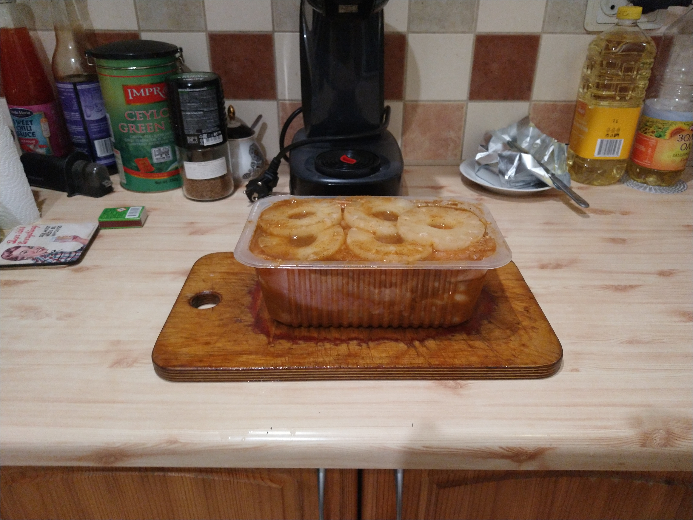
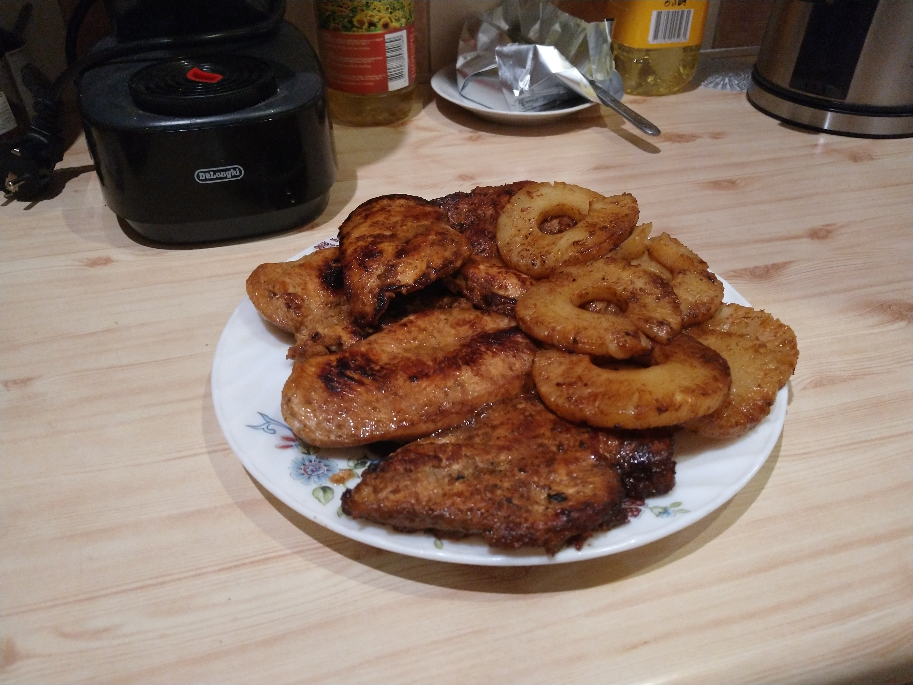

One of my hobbies is cooking, and recently I was wondering about whether there is such a thing as a chicken steak? I believe there is, and here is my interpretation.

#### Ingredients:

1. Chicken breast fillet -- 1 kg / 2.2 lb;

2. A medium can of pineapple rings;

3. Dark soy sauce -- 10 tablespoons;

4. One large onion;

5. One head of garlic;

6. Two packs of whatever salt free chicken seasonings (~30 grams / 1 ounce)

#### Preparation: Fill a container with all the ingredients

1. Cut the onion in thin rings;

2. Use garlic press to mince garlic; 

3. Pour all the pineapple juice from the can;

4. Add soy sauce and seasonings; 

5. Mix it all up;

6. Slice each chicken breast horizontally and add it to the mix along with pineapple rings

8. Let it sit for a couple of hours.

#### Cooking:

I normally cook it on the grill, but sometimes it is too much of a hustle, it specially during the winter time. Here are some tips to make it taste great when using a frying pan:

* 2 minutes on a slow fire for each side;

* Afterwards cook each side on a high heat untill all the water has evaporated and the cololor is nicely redish brown;

* It is better to undercook than overcook, because the first condition can be easily fixed;

* The pineapple rings take about 1 minute on a high heat, for each side.

#### Voilà:

I usually serve it with egg noodles, rice, or simply with some nice bread and fresh vegetables.

till next post

