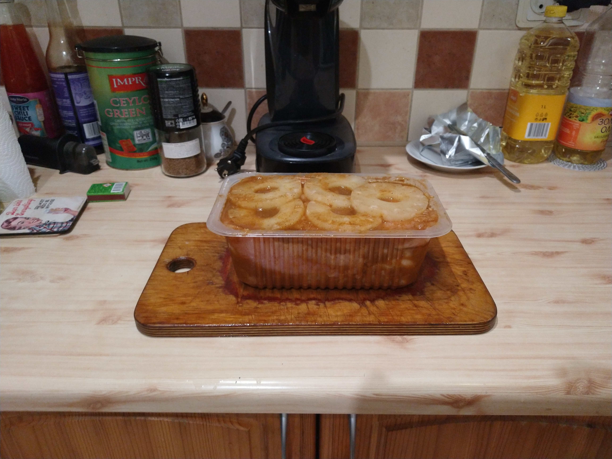

Viens no maniem hobijiem ir ēdiena gatavošana un nesen es aizdomājos par to, vai pastāv tāda lieta kā vistas steiks? Manuprāt, pastāv un lūk mana interpretācija par to. 

#### Sastāvdaļas:

1. Vistas krūtiņas fileja -- 1 kg;

2. Vidēja izmēra konservētu ananāsu gredzenu bundžiņa;

3. Tumšā sojas mērce -- 10 ēdamkarotes;

4. Viens liels sīpols;

5. Viena ķiploka galviņa;

6. Divas paciņas jebkādu vistas garšvielu bez sāls (~30 grami)

#### Sagatavošana: Piepildiet trauku ar visām sastāvdaļām

1. Sagriezt sīpolu plānos gredzenos;

2. Saspiest ķiploku ar spiedi; 

3. Ieliet traukā visu ananāsu sulu no bundžas;

4. Pievienot sojas mērci un garšvielas; 

5. Visu samaisīt;

6. Horizontāli pārgriezt vistas filejas gabaliņus un kopā ar ananāsu gredzeniem ievietot traukā;

8. Atstāt uz pāris stundām.

#### Pagatavošana:

Es parasti izmantoju grilu, taču tā ir ļoti liela noņemšanās, it īpaši ziemā. Pāris ieteikumi, lai šo ēdienu garšīgi pagatavotu arī uz pannas:

* 2 minūtes uz lēnas liesmas no abām pusēm;

* Pēc tam uz lielas liesmas cep no abām pusēm kamēr viss ūdens ir iztvaikojis un vista ir ieguvusi sarkanīgi brūnu nokrāsu;

* Labāk kārtīgi neizcept, nekā pārcept, jo pirmo stāvokli var viegli izlabot;

* Ananasu gredzenus cepu aptuveni vienu minūti no katras puses uz lielas liesmas.

#### Voilà:

Parasti es šo ēdienu pasniedzu ar olu nūdelēm, rīsiem, vai vienkārši kādu garšīgu maizi un svaigiem dārzeņiem.

līdz nākamajam ierakstam

