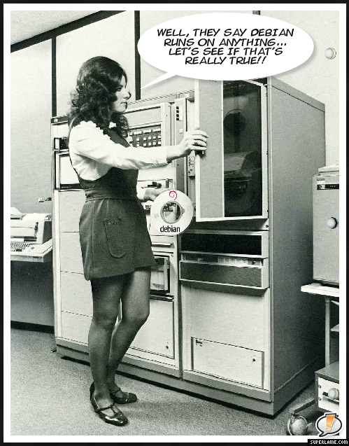
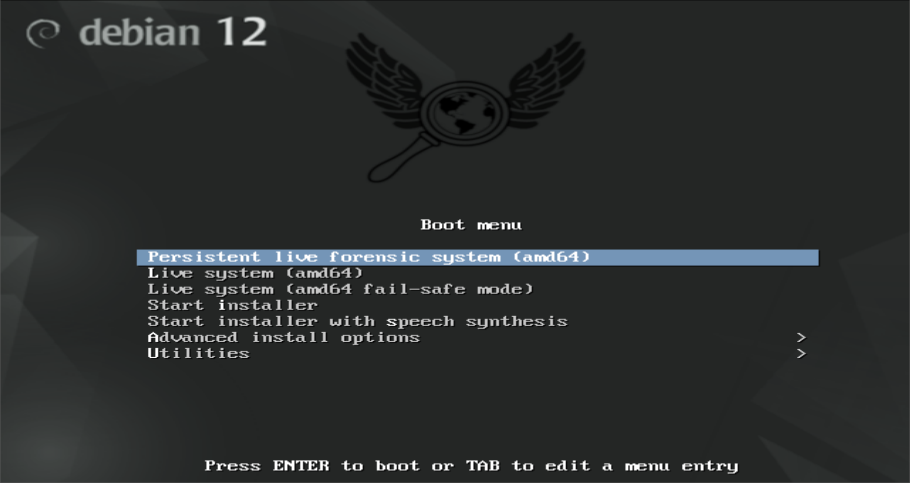

## They say Debian runs on anything...
<center></center>

### Perfect for use as a bootable live system

Bootable live systems come in handy in troubleshooting hardware, examining and manipulating systems and exporting information. 

### Forensics and security focused Linux distributions

There are numerous forensics and security focused Linux distributions out there, to name a few -- Kali Linux, Parrot OS, CAINE Linux, Tsurugi Linux, Sumuri's PALADIN. All these Linux distributions are based on Debian or Ubuntu (which is based on Debian). 

### Why I still opt for good ol' Debian as the go-to live distro

I am not into penetration testing therefore I do not need the latest and greatest, also I am comfortable working with CLI and I don't need no fancy GUI's. What I need is a stable "no bullshit" experience to accomplish a few simple tasks -- boot, explore, image, mount & manipulate (move & resize partitions, edit files). 

### Debian persistent live forensic system

<center></center>

It can boot pretty much any device that has a 64-bit CPU, does not matter if the device uses BIOS or UEFI, and it get's along with secure boot real nice. Yes, the boot menu is boringly grey, as not to attract any unnecessary attention when used in public.



## How to create a Debian persistent live system

### Get the live .iso

Open the official [Debian homepage](https://cdimage.debian.org/debian-cd/current-live/amd64/iso-hybrid/) and choose the live image that features the desktop environment of your choice. I really enjoy GNOME but if you intend to boot older hardware XFCE would probably be the best choice.

### Customize the .iso

The very minimum customization requirement -- a GRUB boot menu entry in both BIOS and UEFI boot environments. The commands should be run as root.

Prerequisites: **xorriso**, **isolinux**, **rsync**
<br>
<br>  

**1. Mount the image to a mountpoint of your choice**


mount debian-live.iso /media/your-mount-point



**2. Sync the image content to a folder of your choice**


rsync -a /media/your-mount-point /home/user/synced-iso


**3. Add a GRUB boot menu entry for BIOS by editting /synced-iso/_isolinux/live.cfg_**

_Example boot menu entry from my system_

```
label live-amd64
	menu label ^Persistent live forensic system (amd64)
	menu default
	linux /live/vmlinuz
	initrd /live/initrd.img
	append boot=live components noswap noautomount persistence
```

The boot parameters _no swap_ and _noautomount_ are commonly used to ensure forensic soundness -- the disk drives present in the device will not be mounted or used for swap space.
<br>
<br>

**4. Add a GRUB boot menu entry for UEFI by editting /synced-iso/boot/_grub/grub.cfg_**

_Example boot menu entry from my system_

```
menuentry "Persistent forensic live system (amd64)" --hotkey=l {
	linux	/live/vmlinuz-6.1.0-10-amd64 boot=live components noswap noautomount persistence findiso=${iso_path}
	initrd	/live/initrd.img-6.1.0-10-amd64
}
```

**5. Add a boot screen background of your choice**

The files to be edited are:  
```
/synced-iso/isolinux/splash800x600.png
/synced-iso/isolinux/splash.png
```

**6. Build your custom .iso**

I use the following Bash oneliner to build my .isos, just make sure you **set the correct synced-iso directory at the end of the oneliner** and run it from the parent directory.

```
xorriso \
    -as mkisofs \
    -r \
    -V "Debian 12 BigD Repack" \
    -o "debian12_BigD_repack_$(date '+%d-%m-%Y_%H.%M.%S').iso" \
    -R \
    -J \
    -joliet-long \
    -cache-inodes \
    -isohybrid-mbr /usr/lib/ISOLINUX/isohdpfx.bin \
    -partition_offset 16 \
    -b isolinux/isolinux.bin \
    -c isolinux/boot.cat \
    -boot-load-size 4 \
    -no-emul-boot \
    -boot-info-table \
    -eltorito-alt-boot \
    -e boot/grub/efi.img \
    -no-emul-boot \
    -isohybrid-gpt-basdat \
    -isohybrid-apm-hfsplus \
    synced-iso
```

After the above command is finished, you should have your custom .iso file. Now it is time to dump the .iso to a disk and to add a partition for persistence. 

### Creating a persistent bootable USB stick with the custom .iso

**1. Dump the .iso to a USB stick**

**dd** is a very dangerous command. Make sure you use the correct device identificator (/dev/sdX) for your USB stick, otherwise you could end up overwritting your system drive.




dd if=my-custom.iso conv=sync,noerror bs=8192 of=/dev/sdX


**2. Create a partition for persistence**

All the user data including the installed programs will be stored in this partition.


fdisk --wipe=never -t dos /dev/sdX


**fdisk** features an interactive prompt and in order to create a third partition on your USB stick, that would occupy the remaining disk space, you can just hit: **n**, **p**, **Enter**, **Enter**, **Enter**, **w**. 
<br>
<br>


**3. Create an EXT4 filesystem labeled "persistence" in the newly created partition**


mkfs.ext4 -L "persistence" /dev/sdX3


**4. Mount the partition and create a configuration file for persistence**


mount /dev/sdX3 /media/mountpoint-of-choice



echo "/ union" > /media/mountpoint-of-choice/persistence.conf


## That's it. Time to boot.

### First things first. Adding "User" to sudoers

On the first boot you should add the default "User" to sudoers, so you can escalate privileges with sudo. To do this you can just escalate privelages with **su** and edit the **/etc/sudoers** file adding the following line:

```
User	ALL=(ALL:ALL) ALL
```

P.S. The default password for the default "User" is "live".


