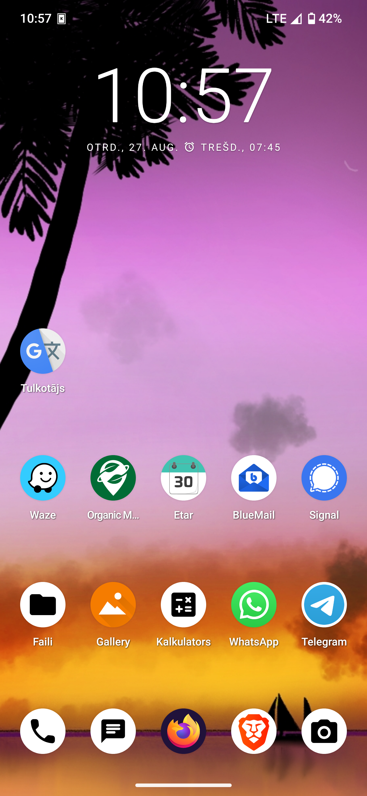
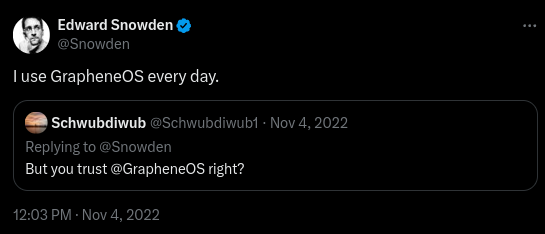

    

### Bye bye Moto and [LineageOS](https://dvilcans.com/lineage-os/)

The screen on my old Motorola Moto G7 finally gave out, so I got myself a Google Pixel, mainly because it’s the only phone brand that is supported by GrapheneOS. I’ve been hearing about GrapheneOS for years and finally wanted to try it out myself.

### A little bit about the Pixel

My budget was limited, so I went with the Pixel 6 Pro. Physically, the device looks and feels very solid. It has 12 GB of RAM, which is three times as much as my old Moto had. It also has 128 GB of internal storage, but at the same time there is no SD card slot and only one SIM slot. 

It comes with Android 12 and is upgradeable to Android 14. After using LineageOS for about 3 years, I realized I would never go back to stock OEM Android, and the stock OS on the Pixel confirmed my preferences.

### The stock Android on Pixel

To power off the device, you have to press and hold both the power button and the volume up button. Simply pressing the power button brings up Google’s voice assistant. You can apparently set the power button to its normal behavior in the settings. On a positive note, the stock OS appears to be fairly bloatware-free. These were my only impressions, as I only updated the stock OS from version 12 to 14 to ensure smooth flashing.

### GrapheneOS: The installation

It installed like a charm via the [web installer](https://grapheneos.org/install/web). The instructions on the web install page were clear and precise. I was extremely impressed with the web installer. The developers of GrapheneOS have ensured that anyone, and I mean it, literally anyone, not just the tech-savy, can flash their devices with this OS. And unlike most custom ROM's, GrapheneOS allows you to lock the bootloader.

### The look and feel
 

Out of the box, GrapheneOS is super minimal. It includes an app for making calls and managing contacts, an SMS app, a gallery app, a calculator, and a web browser called Vanadium—a hardened variant of Chromium. The system app icons are black and white, making it easy to distinguish them from user-installed apps.

The OS is super fast and stable, designed for security-conscious individuals. It features various interesting security-related settings. For example, there is an 'Exploit Protection Compatibility Mode' that can be enabled to ease security settings on apps that may not function properly due to GrapheneOS's exploit protection measures.

GrapheneOS has a lot to offer security-wise -- Edward Snowden can attest to that -- but it also appeals to those who just want a phone free of bloatware and global advertising spyware that simply works as expected.

### I don't miss Google Play at all

You can install Google Play Services on GrapheneOS, but that undermines the whole point of using this OS. Personally, I don’t miss Google Play because I don’t use my phone for NFC payments -- nor will I ever -- and none of the apps I use strictly require Google Play. Actually, I've encountered very few apps that strictly require Google Play Services, and most of those have been Google apps.

The only apps for which I had to find alternatives were Google Maps (needed for offline maps) and Google Authenticator (for 2FA). For those, I now use:

* Organic Maps
* Aegis Authenticator

It is interesting, though, that both Google Maps and Google Authenticator worked on my LineageOS install, where I also did not have Google Play Services.

### To sum up

LineageOS is great for reviving older devices, as it is compatible with a very wide range of smartphones and tablets. However, it cannot match GrapheneOS's performance and security. This is understandable, as supporting dozens of devices is quite different from supporting just a couple.

