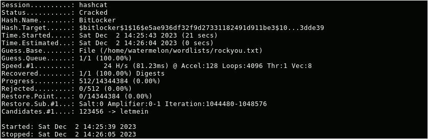
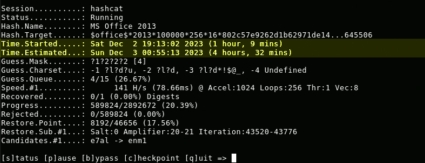
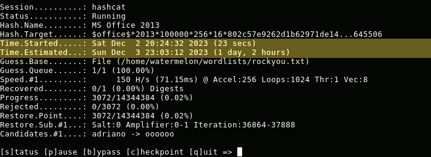

### The world's fastest password cracker

That is according to the tool's [website](https://hashcat.net/hashcat/). The actual speed depends on factors like the hardware, the hash algorithm, and the complexity of the password. In this article I will attempt to crack the password of a Microsoft Word document using a regular laptop without a dedicated GPU. 

### Getting started

Installing Hashcat on Debian GNU/Linux or its derrivatives is very straight forward:


apt install hashcat


For Hashcat to successfully detect your CPU you may also need to install OpenCL drivers. For GPU support you must install the appropriate video drivers and GPU computing packages like CUDA or ROCm. 


### The scenario

Let's say that there is a password protected Word document that we would like to open. Cracking a password with Hashcat consists of just two steps:

1. Extracting the hash
2. Attacking the hash

### What is a hash?

A hash is like a cooked up secret sauce made up from a password, and in some cases, some other additional ingredients. Hashing takes your regular password and mixes it up in a blender, creating a unique jumble of characters. Now, this jumble is the hash. We need to extract this jumble of characters from the encrypted file so that we can attempt to reverse the hashing and reveal one of the initial ingredients of this sauce -- the password. 

### Extracting the hash

The extraction of hashes is performed by scripts. For each encrypted file type you can find a corresponding script on the Internet that will extract the hash. These scripts are usually named in the following fashion -- \<type>2john.ext, for example zip2john.c, telegram2john.py, signal2john.py, etc.

To get the hash from a Microsoft Office document I will use a script called **office2john.py**, it is a Python2 script:


python2 office2john.py secret.docx


Output of the script:

```
secret.docx:$office$*2013*100000*256*16*802c57e9262d1b62971de140217bd37c*e0204f779077b411cb94d121fefbe7f9*273bdd1a02eb43bd0af233e76481039318a60c634b4f216549b429214b645506

```

### Attacking the hash

In order to attack the extracted hash with Hashcat, the hash has to be saved in a file and slightly formatted as per [Hashcat's example hashes](https://hashcat.net/wiki/doku.php?id=example_hashes) guide, in this case I just have to remove the file name and the semicolon. 

So now I have created a file called **secret.hash** that contains the following line:
```
$office$*2013*100000*256*16*802c57e9262d1b62971de140217bd37c*e0204f779077b411cb94d121fefbe7f9*273bdd1a02eb43bd0af233e76481039318a60c634b4f216549b429214b645506
```

#### Brute force


hashcat -O -m 9600 -a 3 -w 3 secret.hash -o secret.pwd


**-O**: optimized OpenCL kernels (max pwd length 32 symbols)  
**-m**: hashmethod  
**-a**: crack method (0 for standard dictionary, 3 for bruteforce)  
**-w**: resource allocation (3 for high)  
**-o**: output file

#### Result

It would take five hours to bruteforce a four symbol password of a Word document on a humble i7-6600U CPU. 




#### Dictionary attack


hashcat -O -m 9600 -a 0 -w 3 secret.hash ~/wordlists/rockyou.txt -o secret.pwd


Attempting a dictionary attack using the same hardware and the very popular rockyou.txt wordlist that contains 14 344 391 passwords. 


#### Result

It would take 1 day and 2 hours for Hashcat to throw all the passwords present in the aforementioned wordlist at the hash of the Word document.




### To sum up

GPUs outperform CPUs by a massive margin when it comes to hash cracking, we're talking about potential speed boosts of 10x, 20x, or even more, depending on the specific hash algorithm and the hardware in play.  

When it comes to Hashcat, having top-notch hardware is great, no doubt. However, it's worth noting that strategic moves can still yield results, even if your hardware isn't the latest and greatest. 

Employing custom wordlists, mask attacks, and other savvy techniques can make a significant impact. It's not just about the horsepower, it's about clever plays and outsmarting the game.

### Additional resources

* [Hashtopolis](https://github.com/hashtopolis/server): Hashcat wrapper for distributed password recovery
* [2hashcat.zip](2hashcat.zip): Scripts that I have accumulated over the years for extracting hashes 


