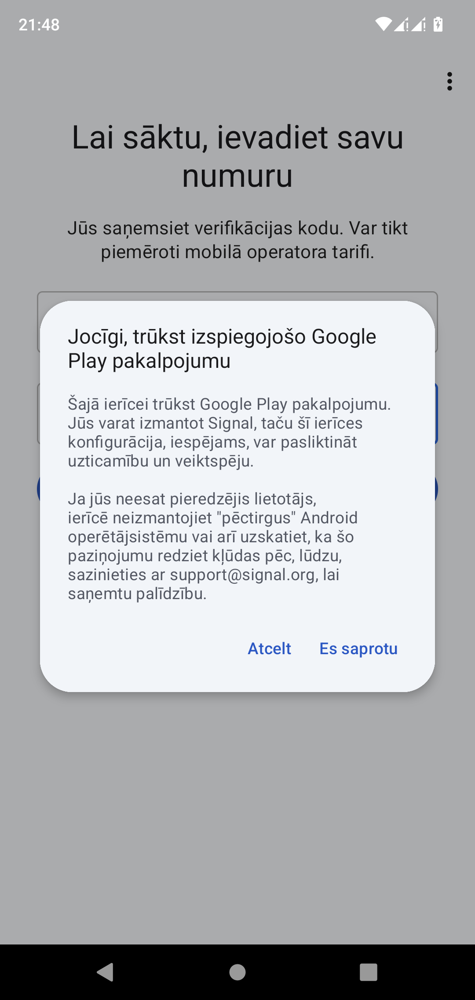

## Lineage OS

Jau vairāk kā gadu savā telefonā izmantoju _[LineageOS](https://lineageos.org/)_, kas ir atvērtā koda entuziastu izstrādāts Android operētājsistēmas variants. 

Zemāk pāris problēmas, ko _LineageOS_ un citi līdzīgi _custom_ _Android_ _ROM_ veiksmīgi atrisina:

###### Bloatware: This is a system app and cannot be uninstalled. 

Nevajadzīga programmatūra, ko nav iespējams atinstalēt. Nē paldies, man nav nepieciešamas jūsu "_Smart Assistant_" un citas tamlīdzīgas, nejēdzīgas aplikācijas un tas ir noziegums pret klientu, ka šādas aplikācijas nav iespējams atinstalēt. Man patīk, ka manā telefonā ir tikai tas, kas man ir nepieciešams un līdz ar to mans telefons strādā ātri un nevainojami, neskatoties uz to, ka tas nav pats jaunākais modelis tirgū.

###### Drošība un privātums

Es varu pilnībā kontrolēt visu aplikāciju atļaujas, pilnībā kontrolēt dažādus sensorus, piemēram, kameru un mikrofonu un jebkurā brīdī tos atspējot. Manā tālrunī nav _Google Play_ pakalpojumu un, kas ir svarīgākais – [_Mobile Advertising ID (MAID)_](https://onaudience.com/mobile-ad-id-user-identification-for-mobile-ad-campaign).

###### Cik droša ir šī operētājsistēma?

Drošāka, kā jebkura _stock_ mobilā operētājsistēma, vai tā būtu _iOS_ vai _Android_, taču šajā ziņā lielu lomu spēlē pats lietotājs. Vairumā gadījumu mobilajos telefonos, kuros uzstādīti dažādi _custom_ Android varianti, būs atslēgts (_unlocked_) tā saucamais _boot loader_, kas nozīmē, ka iegūstot fizisku piekļuvi pie ierīces, uzbrucējam nav īpaši jāpiepūlas, lai iekārtā sāknētu kaut kāda veida ļaunatūru, kas teorētiski pēc tam varētu dzīvot paralēli lietotāja uzstādītajai operētājsistēmai, lietotājam par to neko nenojaušot.

###### Tajā pašā laikā:

Jebkura iekārta, kas kaut uz neilgu brīdi ir nonākusi trešās puses rokās, ir uzskatāma par kompromitētu. Tāpat, es neieteiktu glabāt informāciju, kas ir paredzēta "tikai jūsu acīm", nevienā iekārtā, kas ilgstoši izmanto GSM tīklu, dēļ [šādas](https://en.wikipedia.org/wiki/Pegasus_(spyware)) un citām līdzīgām _zero click*_ spējīgām ļaunatūrām.

_*lietotājam nav nepieciešams veikt nekādas darbības, lai ļaunatūra inficētu viņa iekārtu._ 
