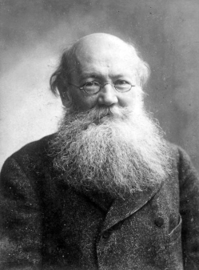
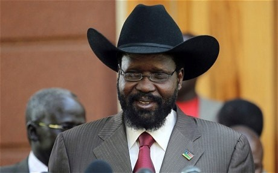
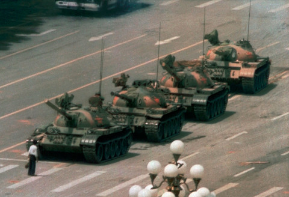

#### A little experiment with [Hugo Quizdown](https://github.com/bonartm/hugo-quiz) implementation and localization



---
primary_color: green
secondary_color: lightgray
text_color: black
shuffle_questions: true
---

## Muslim country ruled by women:

For the past 33 years this muslim country has been led by female prime ministers.

> One of the most densely populated countries in the world – 1'342 people/km².

1. [ ] Albania
  > The correct answer is Bangladesh.
2. [ ] Algeria
  > The correct answer is Bangladesh.
3. [x] Bangladesh
  > Correct answer.
4. [ ] Chad
   > The correct answer is Bangladesh.

## Arrange these events chronologically:
Starting with the oldest 

> The meeting between Gorbachev and Reagan in Reykjavik marked the beginning of the end of the Cold War.

1. India becomes an independant state
2. The assasination of John F. Kennedy
3. Gorbachev meets Reagan at the Reykjavik Summit
4. Fall of the Berlin Wall
5. Kosovo War  

## Who is the man in the photo?

> He was a zoologist and an anarchist, born in Moscow, Russian Empire.

1. [ ] Karl Marx
    > The correct answer is Peter Kropotkin.
1. [x] Peter Kropotkin
    > Correct answer.
1. [ ] Friedrich Engels
    > The correct answer is Peter Kropotkin.
1. [ ] Mikhail Bakunin
    > The correct answer is Peter Kropotkin.
    

## Salva Kiir and cowboy hats:

 
The president of South Sudan Salva Kiir Mayardit is always seen wearing cowboy hats, it has become his trademark. Which politician presented him with his first cowboy hat?

1. [ ] Donald Trump
  > The correct answer is George W. Bush.
2. [X] George W. Bush
  > Correct answer.
3. [ ] Sarah Palin
  > The correct answer is George W. Bush.
4. [ ] Barack Obama
  > The correct answer is George W. Bush.
  
  
## Non-Aligned Movement:

Which of these countries is NOT a member of the Non-Aligned Movement?

1. [ ] Egypt
  > The correct answer is Turkey.
2. [X] Turkey
  > Correct answer. Turkey is a member of the NATO.
3. [ ] India
  > The correct answer is Turkey.
4. [ ] Brazil
  > The correct answer is Turkey.

## Gross National Happiness:

Which country came up with the aforementioned concept?

> This country is a constitutional monarchy.

1. [ ] Congo
  > The correct answer is Bhutan.
2. [ ] India
  > The correct answer is Bhutan.
3. [x] Bhutan
  > Correct answer.
4. [ ] The United Kingdom
   > The correct answer is Bhutan.

## The European Union was initially established as:

1. [ ] The European Post-War Restoration Council
  > The correct answer is European Coal and Steel Community.
2. [x] The European Coal and Steel Community
  > Correct answer.
3. [ ] The European Alliance of Free Citizens
  > The correct answer is European Coal and Steel Community.
4. [ ] The European United Economic Area
   > The correct answer is European Coal and Steel Community.
   
   
## Aircraft carriers:

Which country in 2024 has the largest fleet of active aircraft carriers?

1. [ ] China
  > The correct answer is USA.
2. [ ] France
  > The correct answer is USA.
3. [ ] Russia
  > The correct answer is USA.
4. [x] The United States
   > Correct answer. In 2024 USA has 11 active aircraft carriers.  
   
   
## The first country in the world to adopt Bitcoin as legal tender: 

1. [ ] Turkey
  > The correct answer is El Salvador.
2. [ ] Canada
  > The correct answer is El Salvador.
3. [ ] The United States
  > The correct answer is El Salvador.
4. [x] El Salvador
   > Correct answer.
   
## Where was this photo taken?

> This photo was taken in Tiananmen Square.

1. [ ] Vietnam
  > The correct answer is China.
2. [X] China
  > Correct answer.
3. [ ] Taiwan
  > The correct answer is China.
4. [ ] Kiribati
  > The correct answer is China.
   
   
   

