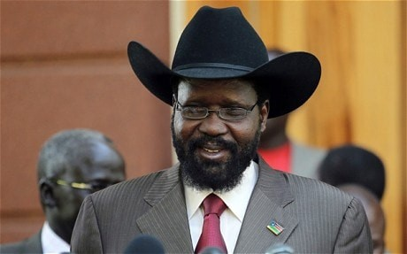



---
primary_color: green
secondary_color: lightgray
text_color: black
shuffle_questions: true
---

## Musulmaņu valsts, ko vada sievietes:

Šo musulmaņu valsti pēdējos 33 gadus ir vadījušas premjerministres sievietes

> Viena no visblīvāk apdzīvotajām valstīm pasaulē – 1'342 cilvēki/km².

1. [ ] Albānija
  > Pareizā atbilde ir Bangladeša.
2. [ ] Alžīrija
  > Pareizā atbilde ir Bangladeša.
3. [x] Bangladeša
  > Pareizā atbilde.
4. [ ] Čada
   > Pareizā atbilde ir Bangladeša.

## Sakārtojiet šos notikumus hronoloģiski:
Sākot ar senāko

> Gorbačova un Reigana tikšanās Reikjavīkā iezīmēja Aukstā kara beigu sākumu.

1. Indija kļūst par neatkarīgu valsti
2. Atentāts pret Džonu Kenediju
3. Gorbačovs un Reigans tiekas Reikjavīkas samitā
4. Berlīnes mūra krišana
5. Kosovas karš  

## Kas ir attēlā redzamais vīrietis?

> Viņš bija zoologs un anarhists, dzimis Maskavā, Krievijas Impērijā

1. [ ] Kārlis Markss
    > Pareizā atbilde ir Pjotrs Kropotkins.
1. [x] Pjotrs Kropotkins
    > Pareizā atbilde.
1. [ ] Frīdrihs Engelss
    > Pareizā atbilde ir Pjotrs Kropotkins.
1. [ ] Mihails Bakuņins
    > Pareizā atbilde ir Pjotrs Kropotkins.
    

## Salva Kīra kovboja cepures:

 
Dienvidsudānas prezidents Salva Kīrs vienmēr ir redzams ar kovboja cepuri galvā. Kurš politiķis Salva Kīram uzdāvināja viņa pirmo kovboja cepuri? 

1. [ ] Donalds Tramps
  > Pareizā atbilde ir Džordžs V. Bušs.
2. [X] Džordžs V. Bušs
  > Pareizā atbilde.
3. [ ] Sāra Peilina
  > Pareizā atbilde ir Džordžs V. Bušs.
4. [ ] Baraks Obama
  > Pareizā atbilde ir Džordžs V. Bušs.
  
  
## Nepievienošanās kustība:

Kura no šīm valstīm NAV Nepievienošanās kustības dalībniece

1. [ ] Ēģipte
  > Pareizā atbilde ir Turcija.
2. [X] Turcija
  > Pareizā atbilde. Turcija ir NATO dalībvalsts.
3. [ ] Indija
  > Pareizā atbilde ir Turcija.
4. [ ] Brazīlija
  > Pareizā atbilde ir Turcija.

## Laimes indekss – Gross National Happiness:

Kura valsts nāca klajā ar augstākminēto konceptu?

> Šīs valsts iekārta ir konstitucionālā monarhija

1. [ ] Kongo
  > Pareizā atbilde ir Butāna.
2. [ ] Indija
  > Pareizā atbilde ir Butāna.
3. [x] Butāna
  > Pareizā atbilde.
4. [ ] Apvienotā Karaliste
   > Pareizā atbilde ir Butāna.

## Eiropas Savienība sākotnēji tika nodibināta kā:

1. [ ] Eiropas Pēckara atjaunošanas padome
  > Pareizā atbilde ir Eiropas Ogļu un tērauda kopiena.
2. [x] Eiropas Ogļu un tērauda kopiena
  > Pareizā atbilde.
3. [ ] Eiropas Brīvo pilsoņu apvienība
  > Pareizā atbilde ir Eiropas Ogļu un tērauda kopiena.
4. [ ] Eiropas Vienotā ekonomiskā zona
   > Pareizā atbilde ir Eiropas Ogļu un tērauda kopiena.
   
   
## Aviācijas bāzes kuģi:

Kura valsts 2024.gadā var lepoties ar vieslielāko aktīvo aviācijas bāzes kuģu floti?

1. [ ] Ķīna
  > Pareizā atbilde ASV.
2. [ ] Francija
  > Pareizā atbilde ASV.
3. [ ] Krievija
  > Pareizā atbilde ASV.
4. [x] Amerikas Savienotās Valstis
   > Pareizā atbilde. 2024.gadā – 11.  
   
   
## Pirmā valsts pasaulē, kas ieviesa Bitcoin kā legālu maksāšanas līdzekli:

1. [ ] Turcija
  > Pareizā atbilde ir Salvadora.
2. [ ] Kanāda
  > Pareizā atbilde ir Salvadora.
3. [ ] Amerikas Savienotās Valstis
  > Pareizā atbilde ir Salvadora.
4. [x] Salvadora
   > Pareizā atbilde.
   
## Kur ir uzņemta šī fotogrāfija?

> Šī fotogrāfija ir uzņemta Tiaņaņmeņa laukumā.

1. [ ] Vjetnamā
  > Pareizā atbilde ir Ķīnā.
2. [X] Ķīnā
  > Pareizā atbilde.
3. [ ] Taivānā
  > Pareizā atbilde ir Ķīnā.
4. [ ] Kiribati
  > Pareizā atbilde ir Ķīnā.   
  



