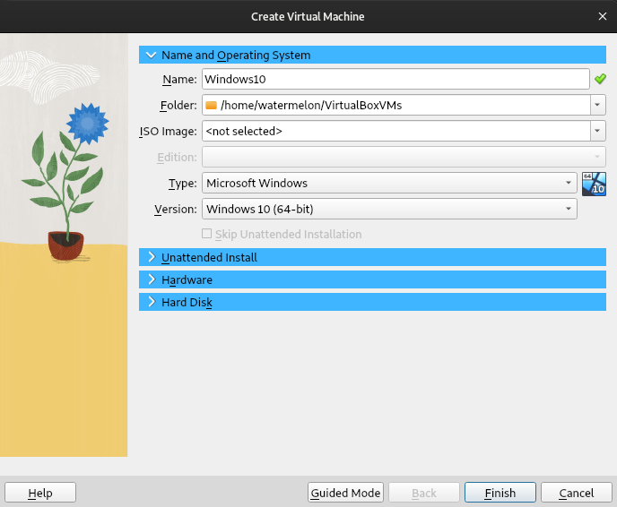
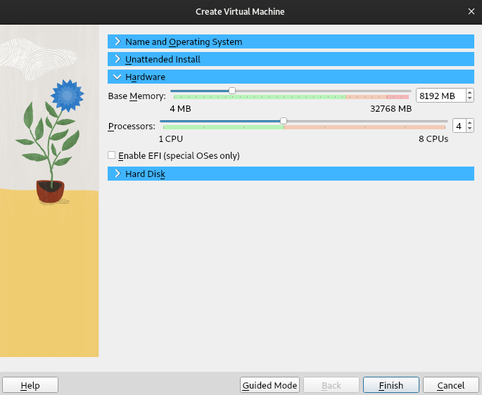
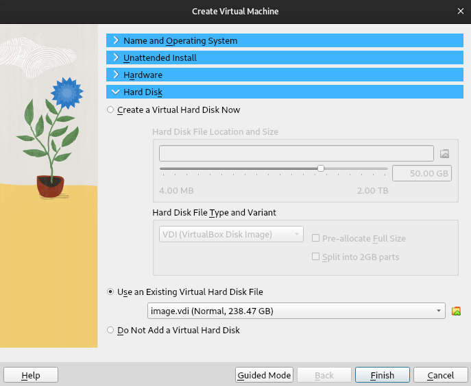
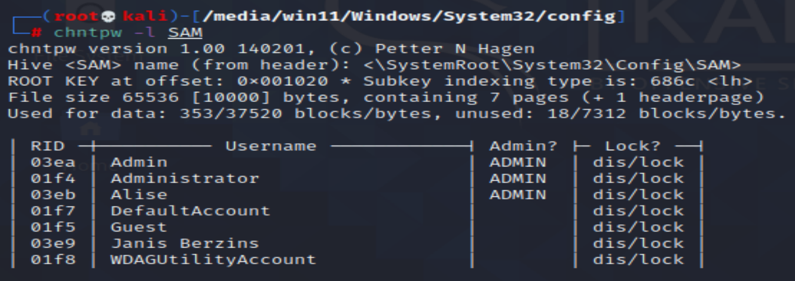
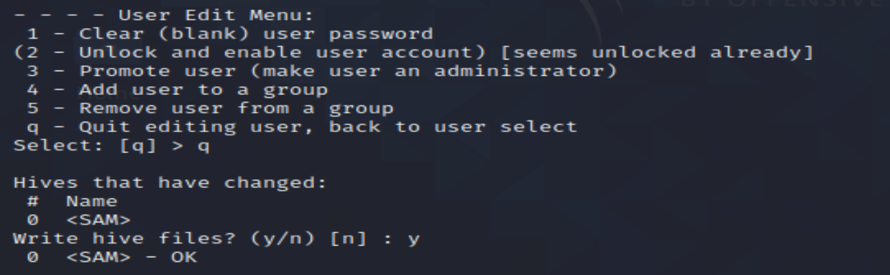

I often virtualize computer images for the purposes of analysis, testing and troubleshooting. It is very fun as you can get the feel of what the user actually experienced when working with the machine. Also it gives you the opportunity to effectively try out and test new things in a controlled environment. Something went wrong? Rollback the changes and try again. 



The above screenshot might be a little bit misleading in the context of this article, because virtualizing MacOS images is not something that can be easily and commonly done. In the above example the MacOS was installed from scratch.

## Virtualizing with VirtualBox

1. Install VirtualBox;

2. Obtain the disk image in RAW format. You can check out my [guide on imaging](https://dvilcans.com/imaging);

3. Convert the image from RAW to .VDI (_Virtual Disk Image_)


vboxmanage convertdd image.dd image.vdi --format VDI


4. Open VirtualBox, click the button "New" and create a new virtual machine:

* Choose the correct type and version

* Tick the box if the OS is installed with EFI. For Windows 11 you will also have the settings for TPM.

* Choose the converted disk image

## Things to do before booting

I recommend going through the virtual machine's settings it specially checking out the "Display" and "Network" sections. It may be a good idea assigning more video memory and disabling network, atleast for the first boot.

## VirtualBox Guest Additions

To improve the visuals, enable bidirectional clipboard, folder sharing and file dragging-and-dropping you can install VirtualBox Guest Additions on the guest. It is an .iso image which can be attached to the virtual machine as a CD-ROM. 

## Blanking out Windows user passwords

A Windows user password is no biggie and it shouldn't prevent you from exploring the user experience from a first-person view. 

Getting rid of Windows user passwords involves three steps:

1. Booting the virtual machine with a Kali Linux live .iso.
2. Mounting the Windows partition
3. Blanking out the passwords in the SAM file using a little program called **chntpw**

The first step is pretty straightforward. Mounting could require some additional tinkering if the Windows Fast Boot functionality is enabled, in such case the partition will be mounted as read-only because "*the filesystem wasn't safely closed on Windows*".

### Mounting the partition read/write

If Windows Fast Boot functionality is enabled the computer never really shuts down, it sort of hibernates in a very low power state, therfore you get the error about the filesystem not being safely closed, to get around this and mount the partition read/write the following steps can be taken:

1. Run **ntfsfix** on the partition


ntfsfix /dev/sdaX


2. Mount the partition removing the hibernation file


mount -o remove_hiberfile /dev/sdaX /mountpoint


### Feeding the SAM file to chntpw

The SAM (Security Account Manager) file is a Windows registry hive that stores user account information and security descriptors on a local computer. 

1. Navigating to the SAM file


cd /mountpoint/Windows/System32/config


2. Listing all the users in the SAM file


chntpw -l SAM


3. Editing a particular user


chntpw -u Administrator SAM


**chntpw** features an interactive prompt. So you can choose 1 to blank the password and 2 to unlock the account just in case.

## Regarding Windows 11

Windows 11 is encrypted by default and it utilizes the TPM chip, so this means that outside of the original hardware and Windows environment, you won't be able to unlock the BitLocker partition with a password, you will need the recovery key.

## Virtualize responsibly

And don't blank out user passwords without their consent or authorization from higher powers. 

