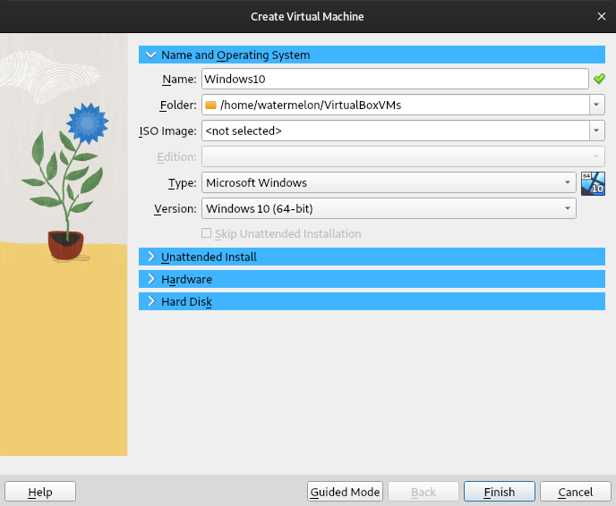
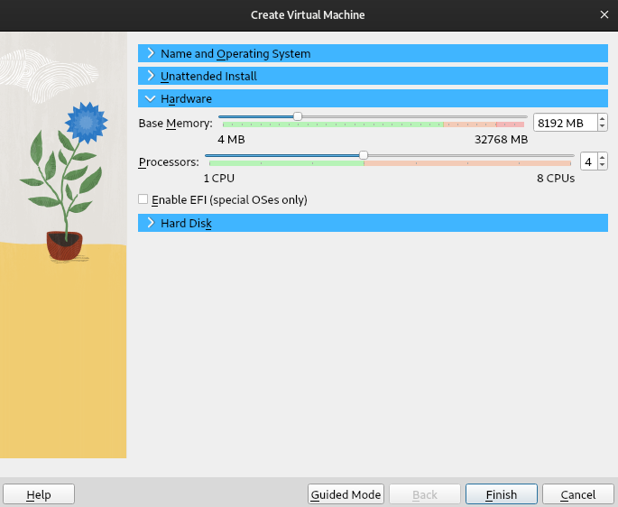

Analīzes, testēšanas un problēmu novēršanas nolūkos es bieži virtualizēju datoru disku attēlus. Tas ir ļoti jautri, jo var izjust to, ko lietotājs faktiski piedzīvoja, strādājot ar datoru. Turklāt tas dod iespēju efektīvi izmēģināt un testēt jaunas lietas kontrolētā vidē. Kaut kas nav izdevies? Atgrieziet izmaiņas un mēģiniet vēlreiz. 



Iepriekš redzamais ekrānšāviņš šī raksta kontekstā var būt nedaudz maldinošs, jo MacOS attēlu virtualizēšana nav kaut kas tāds, kas ir viegli izdarāms. Šajā gadījumā MacOS tika instalēta no nulles.

## Virtualizēšana ar VirtualBox

1. Instalējiet VirtualBox;

2. Iegūstiet diska attēlu RAW formātā. Jūs varat apskatīt manu [rakstu par diska attēlu veidošanu](https://dvilcans.com/imaging);

3. Konvertējiet attēlu no RAW uz .VDI (_Virtual Disk Image_).


vboxmanage convertdd image.dd image.vdi --format VDI


4. Atveriet VirtualBox, noklikšķiniet uz pogas “Jauns” un izveidojiet jaunu virtuālo mašīnu:

* izvēlieties pareizo tipu un versiju.

* Atzīmējiet izvēles rūtiņu, ja operētājsistēma ir instalēta ar EFI. Windows 11 gadījumā jums būs arī TPM iestatījumi.

* Izvēlieties konvertēto diska attēlu

## Lietas, kas jāizdara pirms palaišanas

Es iesaku izpētīt virtuālās mašīnas iestatījumus, īpaši pārbaudot sadaļas “Displejs” un “Tīkls”. Iespējams, būtu labi piešķirt vairāk video atmiņas un atslēgt tīklu, vismaz pirmajā startēšanas reizē.

## VirtualBox Guest Additions

Lai uzlabotu vizuālo darbību, iespējotu divvirzienu starpliktuvi, mapju koplietošanu un failu vilkšanu un nomešanu, varat instalēt VirtualBox Guest Additions. Tas ir .iso attēls, ko var pievienot virtuālajai mašīnai kā CD-ROM. 

## Windows lietotāja paroles noņemšana

Windows lietotāja parole nav nekas nopietns, un tai nevajadzētu traucēt jums izpētīt lietotāja pieredzi no pirmās personas skatupunkta. 

Lai atbrīvotos no Windows lietotāja paroles, ir jāveic trīs soļi:

1. Virtuālās mašīnas palaišana ar Kali Linux _live_ .iso.
2. Windows partīcijas pievienošana
3. Paroļu noņemšana SAM failā, izmantojot nelielu programmu ar nosaukumu **chntpw**.

Pirmais solis ir diezgan vienkāršs. Windows partīcijas pievienošana var prasīt papildu manipulācijas, ja operētājsistēmā ir iespējota Windows ātrās palaišanas funkcionalitāte, tādā gadījumā partīciju izdosies pievienot tikai lasīšanas režīmā, jo “*failu sistēma nebija droši slēgta Windows vidē*”.

#### Nodalījuma uzstādīšana lasīšanai/rakstīšanai

Ja ir iespējota _Windows Fast Boot_ funkcionalitāte, dators nekad īsti neizslēdzas, tas ir kā hibernācijas režīms ar ļoti zemu enerģijas patēriņu, tāpēc tiek saņemta kļūda par to, ka failu sistēma nav droši slēgta, lai to apietu un uzstādītu nodalījumu lasīšanas/rakstīšanas režīmā, var veikt šādas darbības:

1. Apstrādājiet partīciju ar **ntfsfix**


ntfsfix /dev/sdaX


2. Pievienojiet partīciju, noņemot hibernācijas failu


mount -o remove_hiberfile /dev/sdaX /mountpoint


### SAM faila nolasīšana ar chntpw

SAM (Security Account Manager) fails ir Windows reģistra strops, kurā tiek glabāta informācija par lietotāja kontiem un drošības deskriptoriem. 

1. Pārvietošanās uz SAM failu


cd /mountpoint/Windows/System32/config


2. Visu SAM failā esošo lietotāju parādīšana


chntpw -l SAM


3. Konkrēta lietotāja rediģēšana


chntpw -u Administrator SAM


**chntpw** piedāvā interaktīvu saskarni. Tātad varat izvēlēties 1, lai noņemtu paroli un 2, lai iespējotu kontu, gadījumā, ja tas ir bloķēts.

## Attiecībā uz Windows 11

Windows 11 pēc noklusējuma ir šifrēta un izmanto TPM čipu, tāpēc tas nozīmē, ka ārpus oriģinālās aparatūras un Windows vides BitLocker nodalījumu nevarēsiet atbloķēt ar paroli, jums būs nepieciešama atkopšanas atslēga.

## Virtualizējiet atbildīgi

Un nenoņemiet lietotāju paroles bez viņu piekrišanas vai augstāku spēku atļaujas. 
