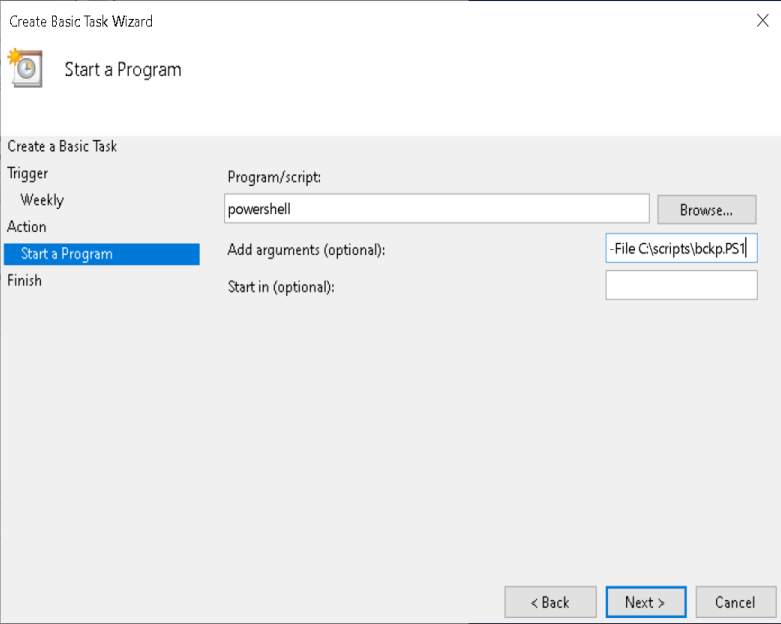

###### Simple automated backup solution by using the Windows built-in tools. Create a PowerShell one-liner and add it to scheduled tasks.

PowerShell one-liner:

```
Robocopy.exe C:\Users\ D:\Windows_backup\Backup_$(Get-Date -format "dd.MM.yyyy_HH.mm.ss") /E /r:0 /w:0
```

* **/E** – copy subdirectories, including empty ones;

* **/r** – number of retries on failed copies;

* **/w** – wait time between retries;

* **$(Get-Date -format "dd.MM.yyyy_HH.mm.ss")** – adds the current date and time to the name of the output subdirectory.


Adapt the above line to your needs and save it in a text file with a .PS1 extension. You may want to experiment with the **/r** and **/w** parameters. 

###### To set up the scheduled task:


**Start > Task Scheduler > Create a Basic Task**

Set up the name, description and trigger. At the "Action" dialog choose the option "Start a program" and point PowerShell to your script:


<center></center>


After setting up the Basic task it is neccessary to check the task properties and adjust the default options that have been set automatically. There are options like "Start the task only if the computer is on AC power", "Run only when user is logged on", etc.


Also you may not be able to execute scripts on your system due to security policy. To enable the execution of scripts you can run the following line in PowerShell:


Set-ExecutionPolicy Unrestricted 


When prompted for input choose "[A] Yes to All".

Be sure to explore the risks before you proceed.
